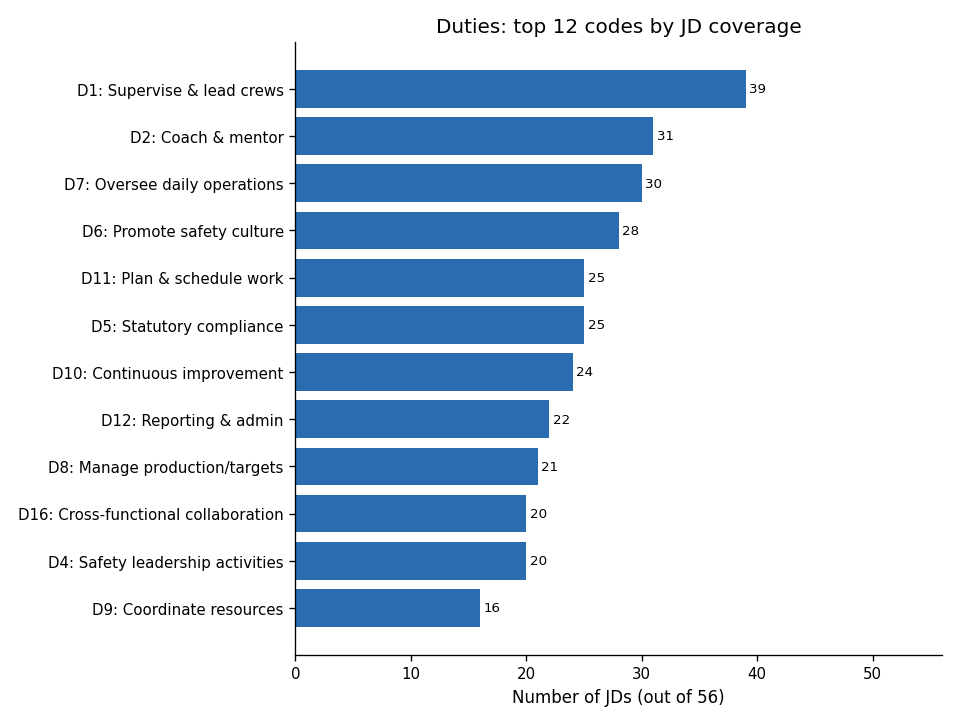
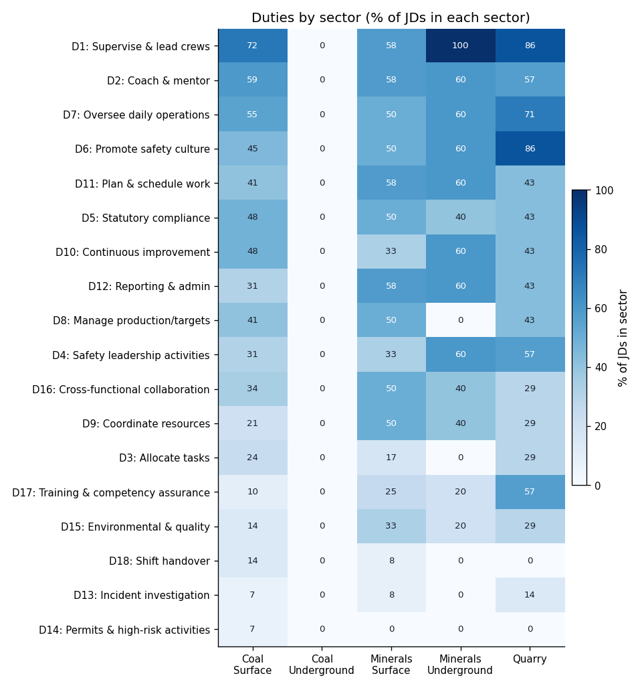
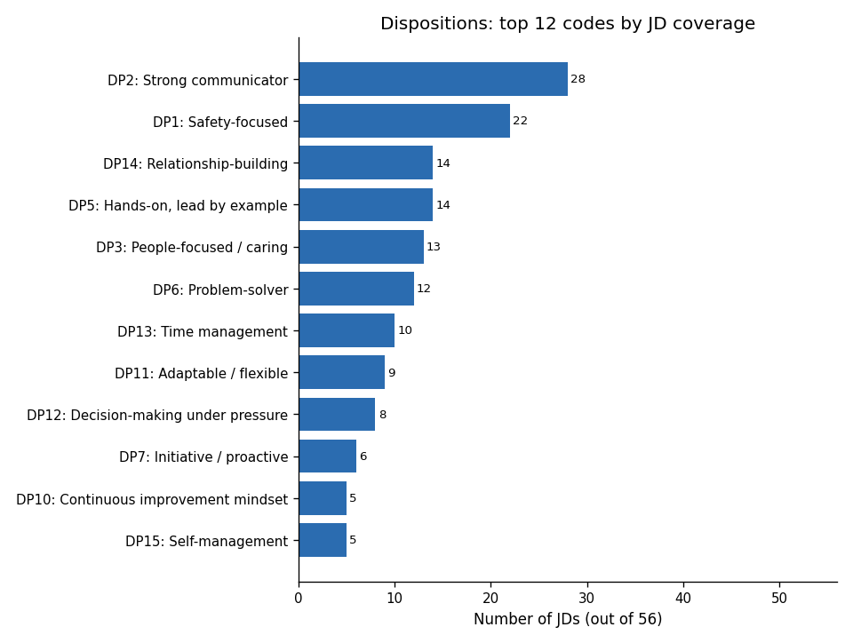
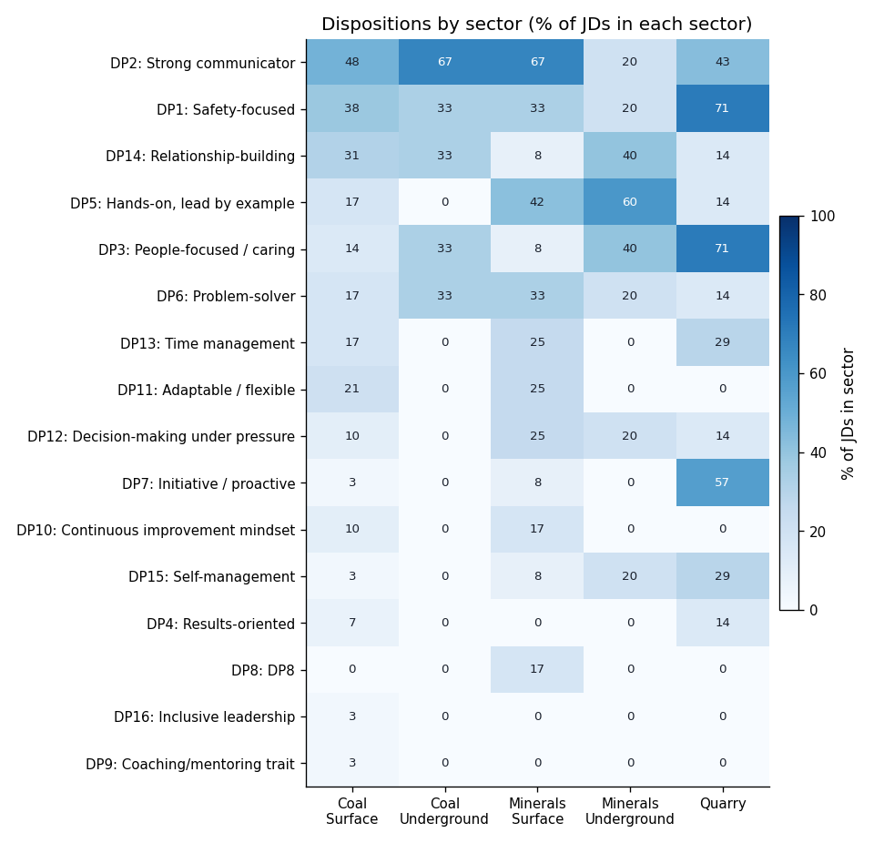
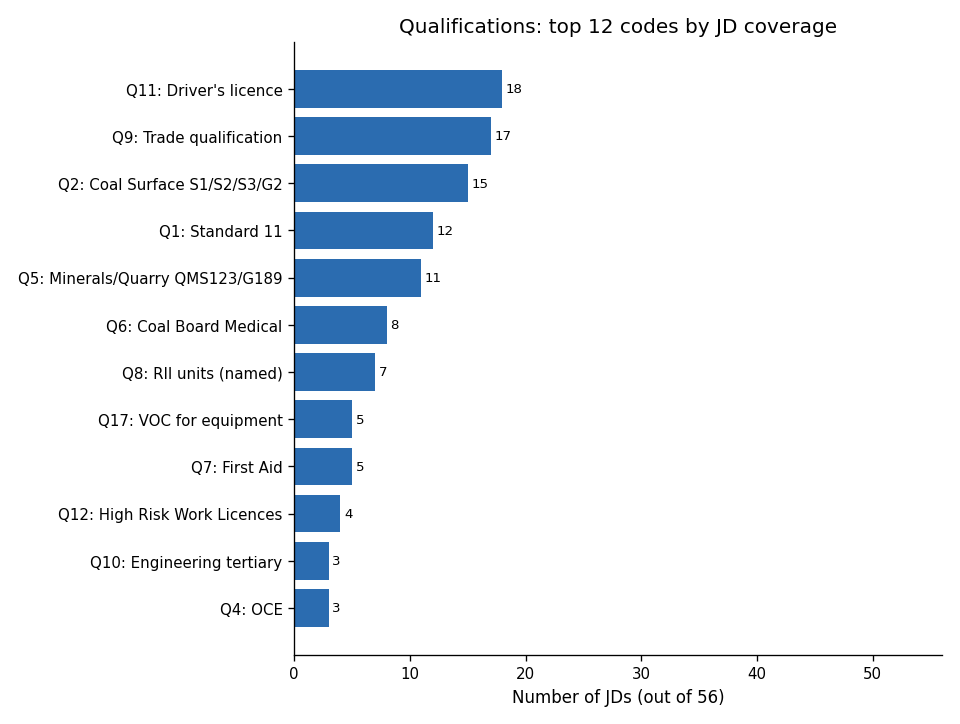
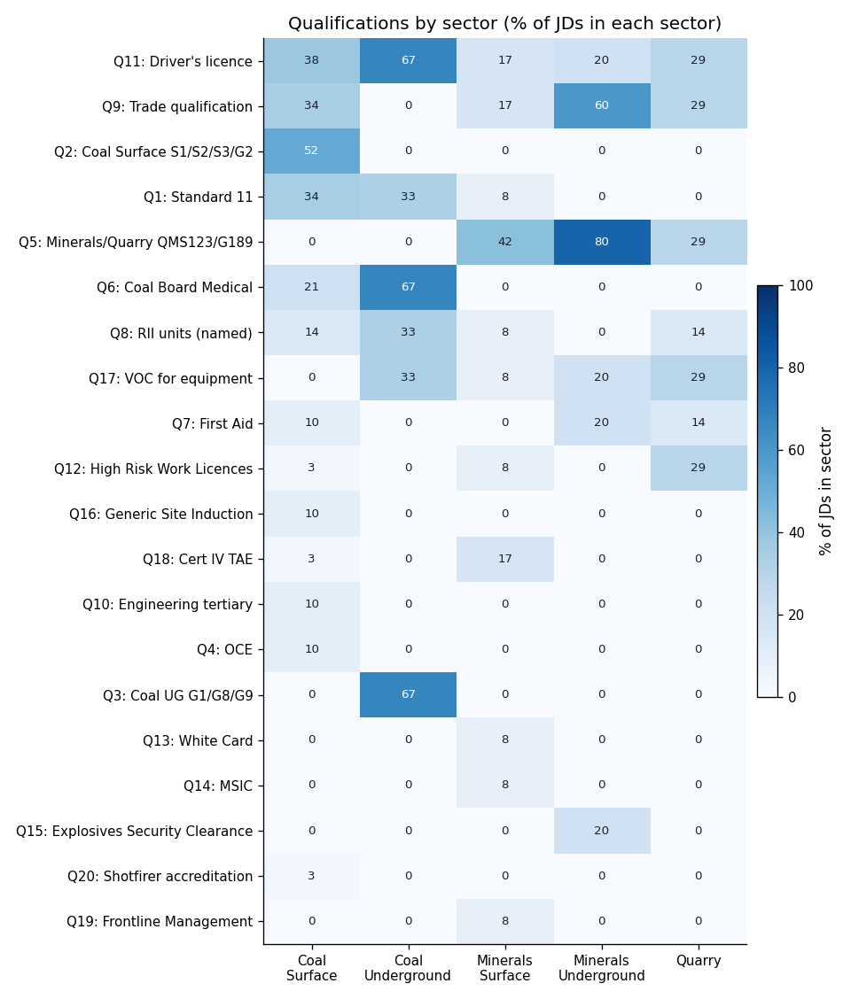
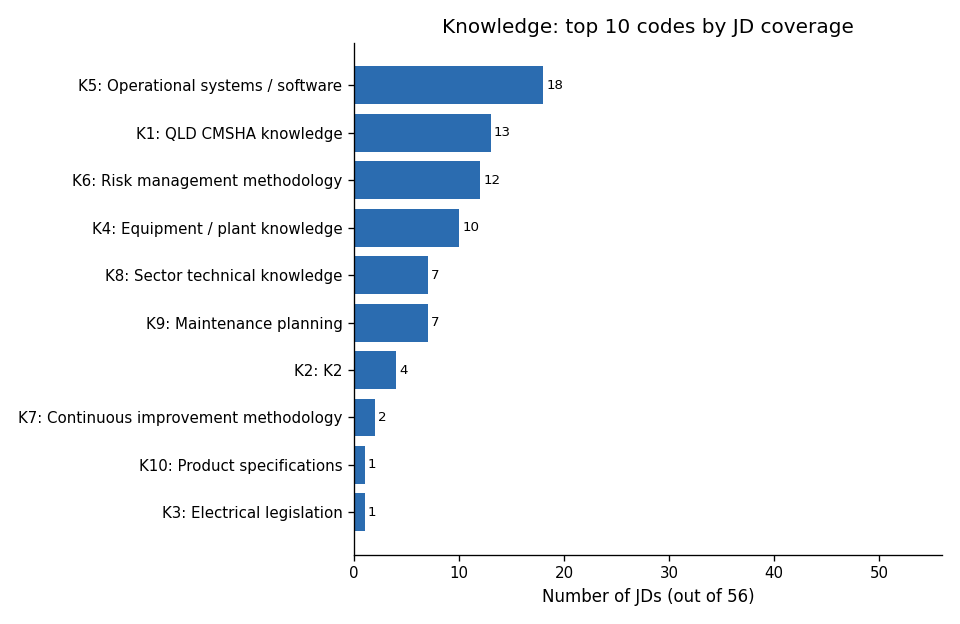
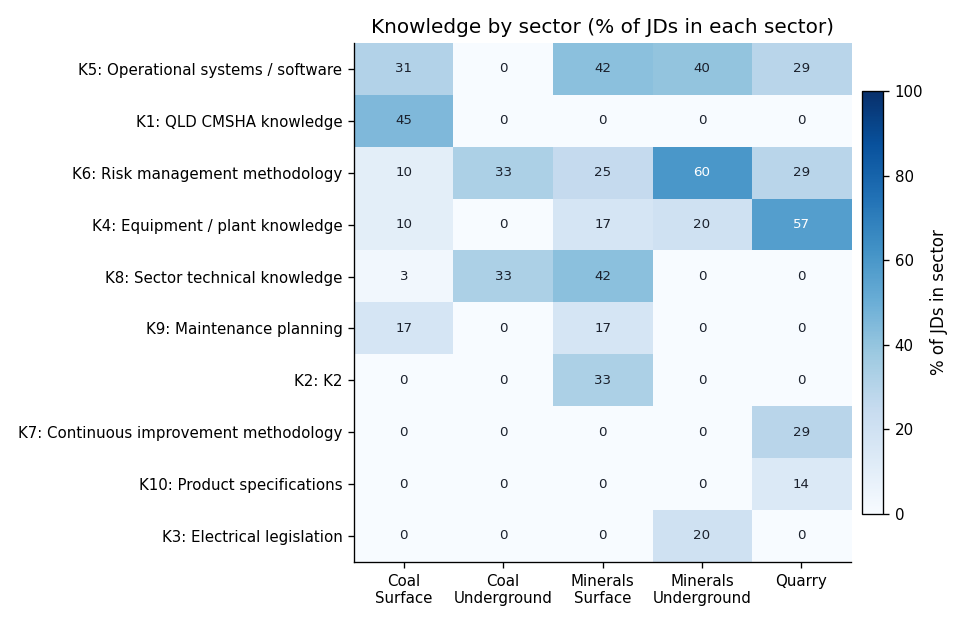
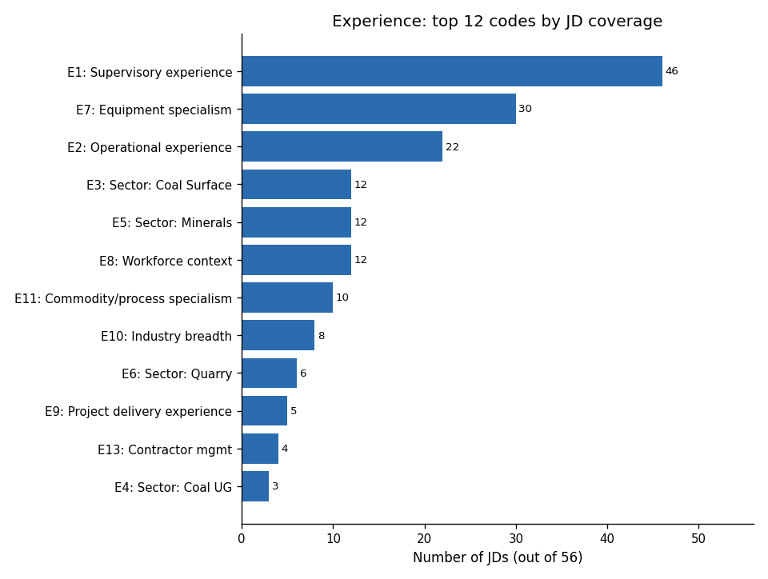
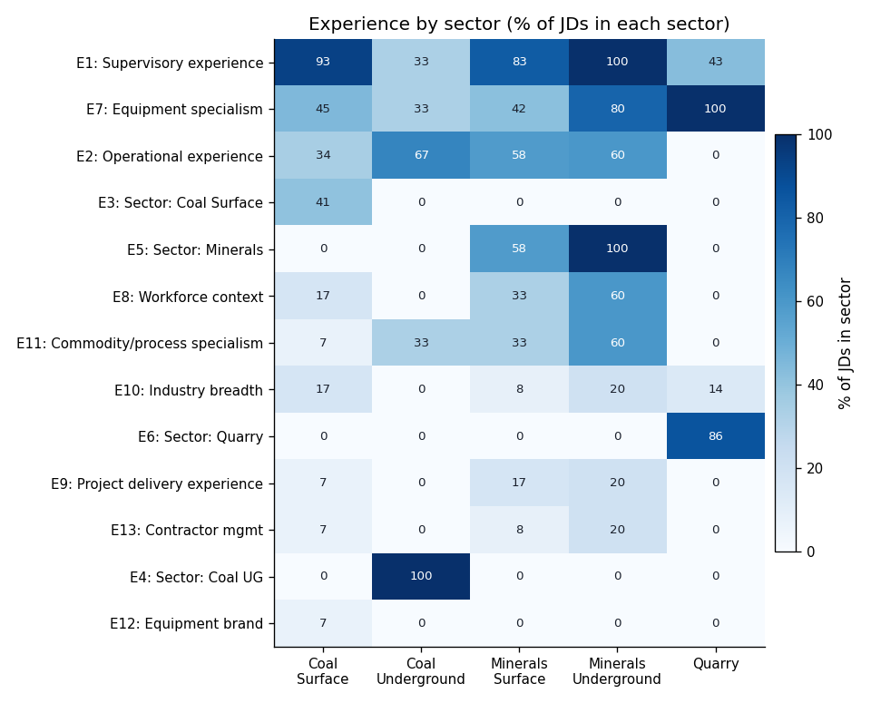

# Executive summary

This analysis examined the content of **56 job descriptions** for frontline supervisor roles in Queensland mining, quarrying and related operations. Each JD was systematically coded against a project-specific codebook of **87 codes across 6 categories**: duties performed, personal dispositions, formal qualifications, domain knowledge, prior experience, and named statutory positions.

**Headline observations:**

- The most-named single expectation in the corpus is supervisory experience (E1), which appears in 46 of 56 JDs (82%).
- The three most-named duties are: supervise and lead crews/contractors (D1) in 39 JDs (70%), coach, mentor and develop team capability (D2) in 31 JDs (55%), and oversee daily operations (D7) in 30 JDs (54%).
- The most-named disposition is strong communicator (DP2), appearing in 28 JDs (50%).
- The most-named formal qualification is a driver's licence (Q11), appearing in 18 JDs (32%); the next most common are trade qualification (Q9) in 17 JDs (30%) and Coal Surface supervisor competencies (Q2) in 15 JDs (27%).
- 53 of 56 JDs (95%) contain at least one of the four safety-related codes (D4, D5, D6, DP1).
- Statutory positions are explicitly named in only 1 of 56 JDs: Open Cut Examiner appointed at Golding OCE Kogan. The remaining 55 JDs require statutory tickets without explicitly being statutory positions.

# Sample description

## Corpus

```{python}
#| label: tbl-sample
#| tbl-cap: "Sample of in-scope JDs by sector"
from IPython.display import Markdown
import pandas as pd
df = pd.read_csv('../coded_data/coded_jds.csv')
sample = df.drop_duplicates('jd_filename')
by_sector = sample.groupby('sector').size().reset_index(name='n')
by_sector['% of sample'] = (by_sector.n / by_sector.n.sum() * 100).round(1)
Markdown(by_sector.to_markdown(index=False))
```

## Role types

```{python}
#| label: tbl-roletypes
#| tbl-cap: "Sample of in-scope JDs by role type"
from IPython.display import Markdown
by_role = sample.groupby('role_type').size().sort_values(ascending=False).reset_index(name='n')
by_role['% of sample'] = (by_role.n / by_role.n.sum() * 100).round(1)
Markdown(by_role.to_markdown(index=False))
```

## Scope criteria

JDs were included if all four criteria were met:

- **Supervisor-level**: frontline supervisor role (not operator, leading hand, superintendent or manager). One exception was retained at Libby's direction: `MacKellar Leading hand.docx`, where the title is "Leading Hand" but the body describes a supervisory role.
- **Queensland-based**: interstate roles excluded.
- **Mining, quarrying or related contractor work**: manufacturing or unrelated industries excluded.
- **A genuine job ad**: generic recruiter listings and reference or example documents excluded.

A separate collation spreadsheet `1_jd_collation.xlsx` in this review package documents the full corpus of 97 source files, including 23 duplicate scrapes, 16 out-of-scope JDs, 2 broken files, and the 56 in-scope canonical JDs that contribute to this analysis. (One JD previously classified as in-scope, `Maintenance_Supervisor.docx`, was reclassified as out-of-scope during this analysis because the role is at Olympic Dam in South Australia, not Queensland.)

# Methodology

## Coding scheme

JDs were coded against **codebook v1.0** (see Appendix A), comprising 87 codes organised into six categories:

| Category | Codes | Definition |
|---|---|---|
| DUTY | 18 | A discrete task the supervisor performs |
| DISPOSITION | 16 | A personal attribute or behavioural trait |
| QUALIFICATIONS | 20 | A formal credential, ticket, license or trade |
| KNOWLEDGE | 10 | A specific body of domain knowledge |
| EXPERIENCE | 14 | A statement of required prior work background |
| STATUTORY POSITION | 9 | A named statutory role the JD appoints to |

The boundaries between categories are clarified through test questions: *what does the supervisor DO* (duty); *what kind of person are they* (disposition); *what do they HOLD* (qualification); *what do they KNOW* (knowledge); *what have they DONE* (experience); *what legal ROLE are they being appointed to* (statutory position). A single sentence can produce multiple coded rows where it spans more than one category.

## The `required` flag

Each coded instance carries a flag indicating how the JD treats it:

- `required`: the JD treats the item as a hard requirement, either through explicit "must have" / "essential" / "required" / "mandatory" language, or by listing it under a requirements-style section heading ("About You", "What you'll bring", "Qualifications", "Skills and Experience", "The successful candidate will possess", etc.) without softening.
- `desirable`: the bullet itself contains softening language ("desirable", "preferred", "advantageous", "highly regarded", "nice to have"), or the bullet sits under a softener section header (e.g. "It will also be beneficial if you have").
- `not_specified`: the row describes a duty performed in the role rather than a requirement the candidate must bring. Duty bullets are not requirements on the candidate, so they default to this flag.

## Coding workflow

For each JD, both the curated metadata (company, role, sector, role type, location) and the full source text were read. Each codable phrase was tagged with category, code, supporting quote, required flag, and confidence rating.

Output format: long-format CSV with one row per `(jd_filename, category, code, evidence_quote)` instance, plus contextual fields (sector, role type, required flag, confidence).

## Limitations

- **Single coder.** All 56 JDs were coded by a single analyst with LLM assistance, with every coded row audited against the source JD via a literal-substring verifier. Inter-coder reliability is not established.
- **Required-flag interpretation.** A row is `required` when the JD treats it as a hard requirement, including when the bullet sits under a requirements-style section heading without softening language. JDs vary widely in how forcefully they word requirements, so the boundary between `required` and `desirable` is sometimes a judgement call at the bullet level.
- **Source detail varies across JDs.** Some JDs are short SEEK or Indeed advertisements with only a handful of headline requirements; others are full multi-page Position Descriptions with detailed responsibilities, qualifications, and knowledge requirements. A JD with fewer coded rows usually reflects less source text, not a coding gap.
- **Coal Surface heavy.** 29 of 56 JDs (52%) are Coal Surface roles. Cross-sector comparisons should be read with the underlying sample sizes in mind.

# Duties

```{python}
#| label: tbl-duty
#| tbl-cap: "Duties: frequency across all 56 JDs"
from IPython.display import Markdown
freq = pd.read_csv('../coded_data/freq_duty.csv').sort_values('n_jds', ascending=False)
Markdown(freq.to_markdown(index=False))
```

{#fig-duty width=85%}

**Observations:**

- The four most-named duties are D1 (supervise and lead crews/contractors, 39 JDs, 70%), D2 (coach, mentor and develop team capability, 31 JDs, 55%), D7 (oversee daily operations, 30 JDs, 54%), and D6 (promote and uphold safety culture, 28 JDs, 50%).
- A close cluster sits just below: D11 (plan and schedule work) and D5 (ensure statutory compliance) are both in 25 JDs (45%); D10 (drive continuous improvement) in 24 (43%); D12 (reporting, budgets and administration) in 22 (39%).
- The least-named duties are D14 (permits, isolations and high-risk activity management, 2 JDs, 4%) and D13 (incident investigation, 4 JDs, 7%).
- D17 (training delivery and competency assurance) is named in 11 JDs (20%), with appearances across all five sectors.
- D18 (shift management and handover) is named in 5 JDs (9%), most in Production Supervisor roles where shift handover is a routine duty.

{#fig-duty-sector width=90%}

# Dispositions

```{python}
#| label: tbl-disposition
#| tbl-cap: "Dispositions: frequency across all 56 JDs"
from IPython.display import Markdown
freq = pd.read_csv('../coded_data/freq_disposition.csv').sort_values('n_jds', ascending=False)
Markdown(freq.to_markdown(index=False))
```

{#fig-disposition width=85%}

**Observations:**

- DP2 (strong communicator) appears in 28 JDs (50%), the highest count in this category.
- DP1 (safety-focused) appears in 22 JDs (39%).
- DP14 (relationship-building or stakeholder management) and DP5 (hands-on or front-line leadership) are tied at 14 JDs (25%); DP3 (people-focused / caring) in 13 (23%); DP6 (problem-solver or analytical) in 12 (21%).
- DP9 (coaching or mentoring orientation as a trait) appears in only 1 JD. D2 (coach, mentor and develop) as a duty appears in 31 JDs (55%). JDs almost always frame mentoring as an action rather than as a trait.
- DP16 (inclusive leadership) appears in 1 JD (Supervisor Blast Crew Goonyella Mine BMA).

{#fig-disposition-sector width=90%}

# Qualifications

```{python}
#| label: tbl-qualifications
#| tbl-cap: "Qualifications: frequency across all 56 JDs"
from IPython.display import Markdown
freq = pd.read_csv('../coded_data/freq_qualifications.csv').sort_values('n_jds', ascending=False)
Markdown(freq.to_markdown(index=False))
```

{#fig-qualifications width=85%}

**Observations:**

- Driver's licence (Q11) appears in 18 JDs (32%), the most-named formal credential in the corpus.
- Trade qualification (Q9) appears in 17 JDs (30%).
- Coal Surface supervisor competencies S1/S2/S3/G2 (Q2) appear in 15 JDs (27%) and Standard 11 (Q1) in 12 JDs (21%).
- Minerals and Quarry supervisor competencies QMS123/G189 (Q5) appear in 11 JDs (20%).
- Coal Underground supervisor competencies (Q3, G1/G8/G9 with G2) appear in only 2 JDs (4%), reflecting the small Coal UG share of the in-scope corpus (3 JDs).
- QLD Coal Board Medical / ResHealth (Q6) appears in 8 JDs (14%); named RII units (Q8) in 7 (12%); First Aid (Q7) and VOC for named equipment (Q17) each in 5 (9%); High Risk Work Licences (Q12) in 4 (7%).
- Open Cut Examiner (Q4) is explicitly named in 3 JDs (5%): Foxleigh Mine, Golding OCE Kogan, and Anglo Production Supervisor Dawson (listed as desirable).
- Niche credentials each appearing in 1 JD: White Card (Q13), MSIC (Q14), Explosives Security Clearance (Q15), Shotfirer accreditation (Q20), and Frontline Management certification (Q19).

{#fig-qualifications-sector width=90%}

# Knowledge

```{python}
#| label: tbl-knowledge
#| tbl-cap: "Knowledge codes: frequency across all 56 JDs"
from IPython.display import Markdown
freq = pd.read_csv('../coded_data/freq_knowledge.csv').sort_values('n_jds', ascending=False)
Markdown(freq.to_markdown(index=False))
```

{#fig-knowledge width=85%}

**Observations:**

- K5 (operational systems or software knowledge) appears in 18 JDs (32%), the most-named knowledge code. Specific systems named across the corpus include Microsoft Office, SAP, PRONTO, INX, Ellipse, CMMS, and Microsoft Project.
- K1 (QLD CMSHA legislative knowledge) appears in 13 JDs (23%).
- K6 (risk management methodology) appears in 12 JDs (21%) and K4 (equipment or plant knowledge) in 10 JDs (18%).
- K8 (sector-specific technical knowledge) and K9 (maintenance planning, scheduling, condition monitoring) each appear in 7 JDs (12%).
- K7 (continuous improvement methodology such as LEAN) appears in 2 JDs (4%): both Boral Quarry sites.
- K3 (electrical installation legislation) and K10 (product specifications) each appear in 1 JD.

{#fig-knowledge-sector width=90%}

# Experience

```{python}
#| label: tbl-experience
#| tbl-cap: "Experience codes: frequency across all 56 JDs"
from IPython.display import Markdown
freq = pd.read_csv('../coded_data/freq_experience.csv').sort_values('n_jds', ascending=False)
Markdown(freq.to_markdown(index=False))
```

{#fig-experience width=85%}

**Observations:**

- E1 (years of supervisory experience) appears in 46 JDs (82%), the highest count of any code in the corpus. Quantified expectations range from 2 to 10 years, with 5 years a common minimum.
- E7 (equipment or operational specialism) appears in 30 JDs (54%).
- E2 (years of operational or production experience) appears in 22 JDs (39%).
- E3 (Coal Surface sector experience), E5 (hard rock or minerals experience), and E8 (workforce context) are each named in 12 JDs (21%).
- E11 (commodity or process specialism) appears in 10 JDs (18%).
- E10 (industry breadth beyond mining) appears in 8 JDs (14%); E6 (Quarry sector experience) in 6 (11%).
- E9 (project delivery or shutdown experience) appears in 5 JDs (9%): BHP Lead Supervisor Shutdown, LMP Project, Projects Crew Supervisor, Glencore MPS Mech, and South32 Cannington Mechanical Supervisor.
- E14 (multi-shift or continuous roster experience) is unnamed in the corpus despite many JDs operating continuous rosters; the code is retained in the codebook but had zero coded instances.

{#fig-experience-sector width=90%}

# Statutory positions

```{python}
#| label: tbl-statutory
#| tbl-cap: "Statutory positions explicitly named in the JD"
from IPython.display import Markdown
freq = pd.read_csv('../coded_data/freq_statutory_position.csv').sort_values('n_jds', ascending=False)
Markdown(freq.to_markdown(index=False))
```

**Observations:**

1 of 56 JDs (2%) explicitly appoints to a named statutory position:

- Golding OCE Kogan (Mining Supervisor, OCE Qualified): appoints to **Open Cut Examiner (SP2)**. The JD says explicitly under Key Responsibilities: "Exercise statutory duties as an Open Cut Examiner (OCE)".

The remaining 55 JDs (98%) require statutory tickets (coded under Qualifications) without explicitly appointing the holder to a named statutory position.

Several JDs come close to an SP appointment without crossing the explicit-naming bar that the coding rule requires:

- **Foxleigh Mine** advertises a "Mining Supervisor / OCE" role but frames OCE in the body as a qualification requirement ("Mining Supervisor with OCE qualifications") rather than an appointment.
- **Brightstar Resources** requires a "Statutory Underground Shift Supervisor ticket" but does not name the holder as the statutory position.
- **Supervisor Blast Crew Goonyella Mine BMA** requires Shotfirer accreditation but does not name the holder as the statutory Shotfirer.

These three JDs are coded under Qualifications (Q4, Q5/Q-equivalent, Q20 respectively). The sparse SP coverage that results is partly a feature of the strict coding rule and partly a feature of the corpus: most QLD mining JDs treat statutory positions as ticket requirements rather than naming the appointment explicitly. This is a candidate for codebook v1.1 review.

# Cross-cutting observations

## Safety language coverage

53 of 56 JDs (95%) contain at least one of the four safety-related codes: D4 (safety leadership activities), D5 (statutory compliance), D6 (promote safety culture), or DP1 (safety-focused disposition). The 3 JDs without any of these safety codes are Development Supervisor (BHP/BMA, a Coal UG pathway role), Jennchem (a multi-role recruiting ad where the supervisor variant has only credentialing requirements), and Production Supervisor (Anglo Dawson, a thin SEEK scrape).

## Required vs desirable rows

Of the 966 coded rows, 526 (54%) are flagged `required` — meaning the JD treats the item as a hard requirement, either through explicit "must"/"essential" language or by listing it under a requirements-style heading (About You, Qualifications, What you'll bring, etc.) without softening. A further 33 (3%) are `desirable`, marked either by the bullet's own softening language ("preferred", "advantageous", "highly regarded") or by a softener section header ("It will also be beneficial if you have"). The remaining 407 (42%) are `not_specified`. These are all DUTY-category rows: they describe what the supervisor does in the role rather than what the candidate must bring, so they don't carry a requirement flag.

## The most-named codes by category

The following table summarises the single most-named code in each category, with the percentage of JDs in which it appears.

```{python}
#| label: tbl-toponly
#| tbl-cap: "Most-named code per category"
from IPython.display import Markdown
import pandas as pd
df = pd.read_csv('../coded_data/coded_jds.csv')
n = df.jd_filename.nunique()
tops = []
for cat in ['DUTY','DISPOSITION','QUALIFICATIONS','KNOWLEDGE','EXPERIENCE','STATUTORY_POSITION']:
    sub = df[df.category==cat]
    cnt = sub.groupby('code')['jd_filename'].nunique().sort_values(ascending=False)
    if len(cnt) > 0:
        top_code = cnt.index[0]
        top_n = cnt.iloc[0]
        tops.append({'Category':cat, 'Top code':top_code, 'n JDs':top_n, '% of JDs':round(top_n/n*100,1)})
Markdown(pd.DataFrame(tops).to_markdown(index=False))
```

## Codes with sparse coverage

Codes appearing in 3 or fewer JDs across the corpus:

- DP4 (results-oriented): 3 JDs
- DP8 (accountable / takes ownership): 2 JDs
- DP9 (coaching/mentoring orientation as trait): 1 JD
- DP16 (inclusive leadership): 1 JD
- K7 (continuous improvement methodology): 2 JDs
- K3 (electrical legislation knowledge): 1 JD
- K10 (product specifications): 1 JD
- E4 (Coal Underground sector experience): 3 JDs
- E12 (equipment brand specialism): 2 JDs
- E14 (multi-shift roster experience): 0 JDs
- Q3 (Coal Underground supervisor competencies): 2 JDs
- Q13 (White Card): 1 JD
- Q14 (MSIC): 1 JD
- Q15 (Explosives Security Clearance): 1 JD
- Q19 (Frontline Management certification): 1 JD
- Q20 (Shotfirer accreditation): 1 JD
- SP1, SP3-SP9: 0 JDs each (only SP2 has a coded instance)

These codes are retained in the codebook for completeness but should be treated as illustrative rather than typical. The cluster of zero-coverage SP codes is a consequence of the strict appointment rule and is discussed in the Statutory positions section above.

# Appendix A: Codebook v1.0 (summary)

The full codebook is included with this review package as `3_codebook_v1.0.docx`. The 87 codes are organised as follows:

- **Duties (18):** leadership and people management (D1 to D3), safety and compliance (D4 to D6), operations and production (D7 to D9), strategy and admin (D10 to D12), specialised functions (D13 to D18).
- **Dispositions (16):** DP1 to DP16, ordered roughly by frequency in the corpus.
- **Qualifications (20):** statutory tickets (Q1 to Q5), medical and first aid (Q6 to Q7), training and certifications (Q8 to Q10), licences and clearances (Q11 to Q15), site and equipment (Q16 to Q17), leadership credentials (Q18 to Q20).
- **Knowledge (10):** legislative (K1 to K3), equipment and systems (K4 to K5), methodology (K6 to K7), domain-specific (K8 to K10).
- **Experience (14):** quantified background (E1 to E2), sector experience (E3 to E6), context (E7 to E14).
- **Statutory positions (9):** CMSHA-defined (SP1 to SP5), QMSHA-defined and other (SP6 to SP9).

# Appendix B: Coding sheet

The full coding sheet is included with this review package as `4_coding_sheet.xlsx`. Each row is one (JD, category, code, evidence) instance with sector, role type, required flag, and confidence. Total: 966 rows across 56 JDs. Every row's evidence value was verified as a verbatim substring of the source JD body.
